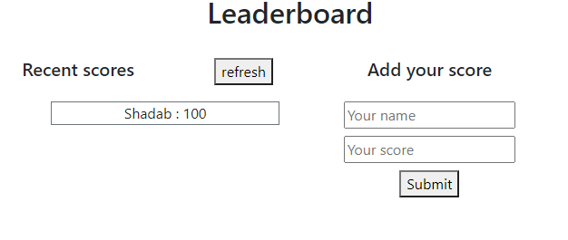

# LeaderBoard

This is the second milestone for the Leaderboard project, which includes the function to send and receive the data from the API.



## Built With

- HTML & CSS

## Live Demo

[Live Demo Link](https://marcosmerida.github.io/LeaderBoard/dist)

## Instalation

To get a local copy up and running follow these simple example steps.
- Open terminal
- Clone this project by command git clone https://github.com/marcosmerida/LeaderBoard.git
- cd to /dist folder
- ```npm update```
- ```npm start```

### Prerequisites

- IDE to edit and run the code (I've used Visual Studio Code 🔥).

### Usage

- For anyone who wants to practice HTML5 and CSS.
- Implementation of webpack set up.

## Authors

👤 **Juan Marcos Mérida**

- GitHub: [@githubhandle](https://github.com/marcosmerida)
- LinkedIn: [LinkedIn](https://linkedin.com/in/marcos-merida-219437206/)

## Show your support

Give a ⭐️ if you like this project!
